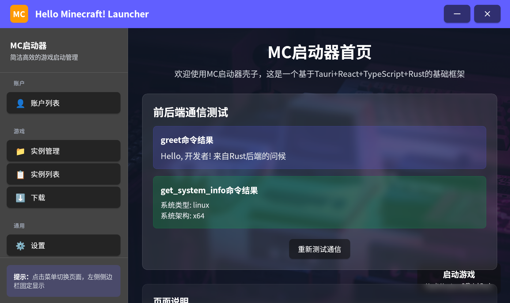
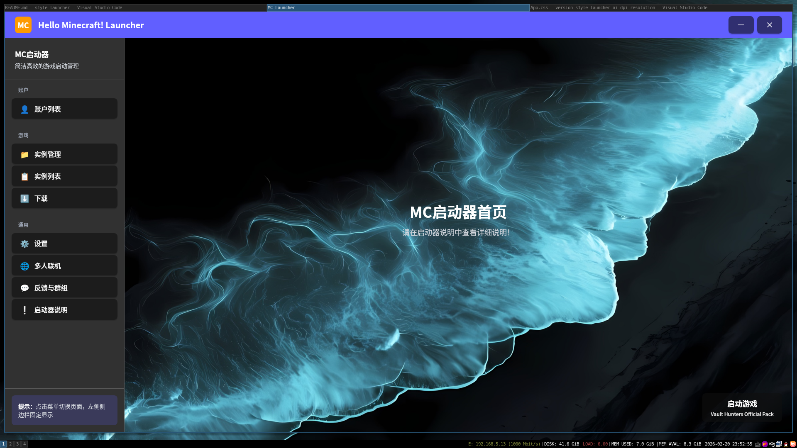
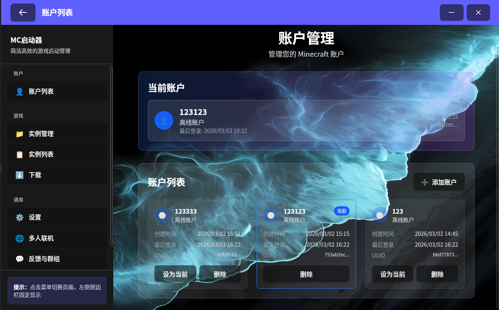

# 关于我的启动器

本项目为开源项目，欢迎开发者参与贡献，共同优化启动器功能：

- 功能建议：可在 `github issue` 中创建并提交建议，或联系我反馈；

- 代码贡献：`Fork` 本项目，提交 `Pull Request`，经审核通过后即可合并；

所有贡献者将在 仓库的 `contributors` 和 `启动器“贡献名单” (待开发)` 中展示，感谢每一位参与者的支持！

## 联系方式

若遇到启动器使用问题、功能建议，可通过以下方式联系我们：

- QQ 联系方式：1373003655
- QQ 群（MC群）：1077212471
- GitHub 仓库：https://github.com/s1yle/s1yle-launcher

****

# 项目构建和未来愿景
## 项目工具链
- tauri
- ts + react 前端
- rust 后端

## 当前项目进度

- [2026年02月18日18:06:32] 实现了初代的ui壳子（照猫画虎 HMCL 的ui）
- [2026年02月20日23:54:09] 小更新版本 v0.1.1 更新了ui和ui动画
- [2026年03月02日16:27:43] 更新了账号模块，前后端交互，添加、删除、选中账号

## TODO 未来计划

> 希望能做出一个有特色的启动器
- 获取版本列表
- 下载不同版本
- 获取java环境
- 启动游戏

## 历史版本

#### v0.1.2
- 完善account模块，支持新增、删除、选中账号
- 支持添加离线账号，并持久化存储

## App 截图

v0.1.0

****

v0.1.1

****

v0.1.2
